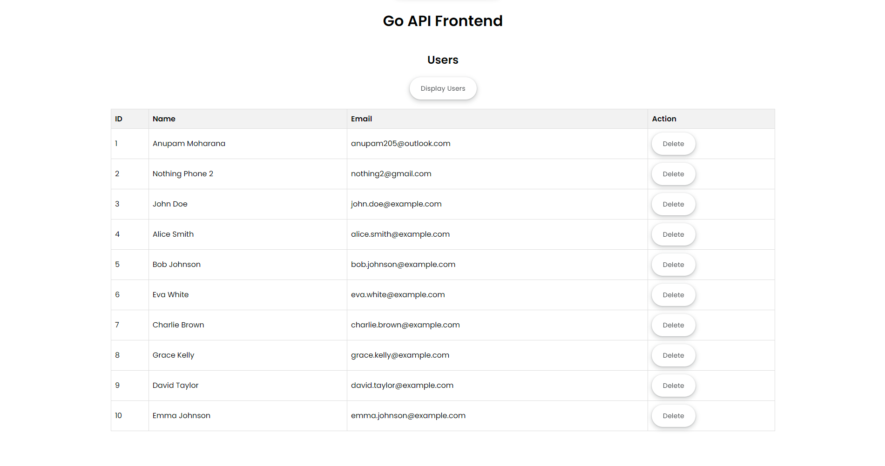

# React Go CRUD Application

This project is a simple CRUD (Create, Read, Update, Delete) application implemented using a Go backend and a React frontend.

## Table of Contents

- [Project Structure](#project-structure)
- [Installation](#installation)
- [Usage](#usage)
- [Backend](#backend)
- [Frontend](#frontend)
- [Additional Features](#additional-features)

## Project Structure

The project consists of two main parts:

1. **Backend (Go):**
   - The Go backend is responsible for handling API requests, connecting to a PostgreSQL database, and performing CRUD operations on the `users` table.

   - Key files:
     - `main.go`: Main entry point for the Go application.
     - `go.mod` and `go.sum`: Go module files specifying dependencies.

   - Docker is used to containerize the Go application.

2. **Frontend (React):**
   - The React frontend provides a user interface for interacting with the backend API.

   - Key files:
     - `src/components/CreateUser.js`: Component for creating a new user.
     - `src/components/Users.js`: Component for displaying a list of users.
     - `src/components/UpdateUser.js`: Component for updating user information.
     - `src/components/UserDetail.js`: Component for displaying details of a specific user.

   - Styles are defined in CSS files (e.g., `src/components/CreateUser.css`).

## Installation

1. **Backend:**
   - Make sure you have Docker installed.
   - Run the following command in the root directory:

     ```bash
     docker-compose up go-app
     ```

2. **Frontend:**
   - Navigate to the `frontend` directory.
   - Run the following commands:

     ```bash
     npm install
     npm start
     ```

   - The React application will be accessible at `http://localhost:3000`.

## Usage

1. Access the React frontend at `http://localhost:3000`.
2. Use the provided UI to perform CRUD operations on the users.

## Backend

### Dependencies

- [Gorilla Mux](https://github.com/gorilla/mux): A powerful HTTP router for the Go programming language.
- [pq](https://github.com/lib/pq): Go PostgreSQL driver.

### Environment Variables

- `DATABASE_URL`: PostgreSQL connection string.

## Frontend

### Dependencies

- [axios](https://axios-http.com): Promise-based HTTP client for the browser and Node.js.
- [React](https://reactjs.org): JavaScript library for building user interfaces.
- [React Router](https://reactrouter.com): Declarative routing for React.js.

## Additional Features

- Error handling: Proper error handling is implemented in both the backend and frontend to handle potential issues.
- User-friendly alerts: Alerts are displayed to the user for successful and failed operations.

UI Demo
-------

# GO-Users
